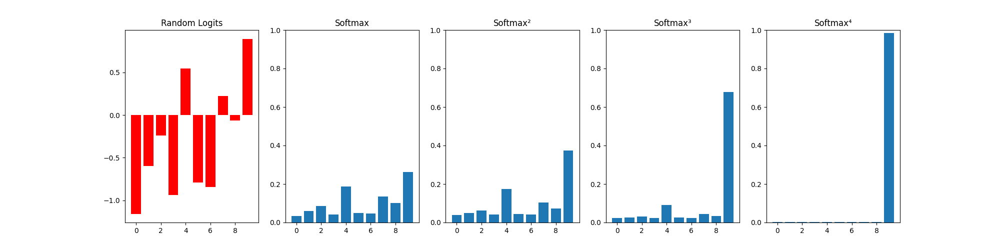

Softmax experiments
=============

Testing if _softmax_ works like a "winner-takes-all" mechanism.

Requires:

    pytorch
    numpy

Finding
--------

Just one layer of softmax does not usually achieve the "winner-takes-all" mechanism.

It requires 2-3 layers of softmax, each with a re-scaling factor >1, and the input values also need to be centered around zero.

Typical run:

Red = input.  On the right are consecutive applications of softmax.  You can see that the last one achieves a winner-takes-all result.

Further questions
-------------------

Mathematically it can be shown that the derivative of softmax is close to zero when it is near "hard max".

Does this mean that this regime is useless for deep learning?

Or perhaps deep learning algorithms tend to work close to the "hard max" limit?  This can be verified by looking at trained models.
